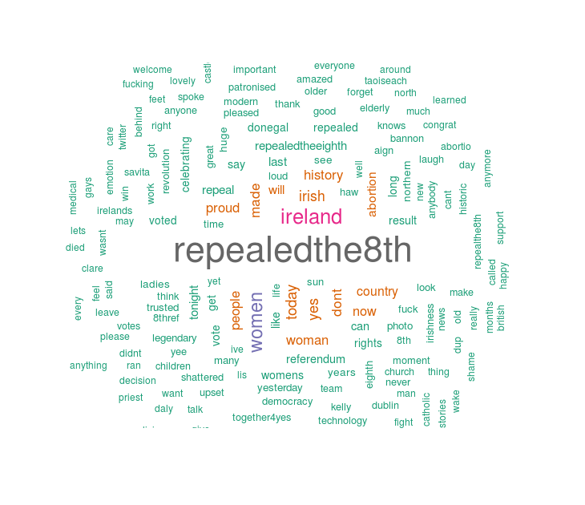

# repealedthe8thsentanalysis
A sentiment analysis in R of #repealedthe8th 

On 25.05.18, Ireland voted to repeal the 8th Amendment of the Constitution, which
banned abortion in all circumstances except when a woman’s life was at risk.

The Referendum results was released on 26.05.18. 
The country voted by 66.4% (YES) to 33.6% (NO) to remove the amendment with more than two million votes cast.

A sample of 10.000 tweets from 27.05.18 using the #Repealedthe8th were collected in order to 
build a wordcloud and develop a sentiment analysis. From the wordcloud it is possible to identify the most common words applyied for the users the day after the referendum results. The sentiment analysis output provides the polarity (positive, negative and neutral) and the subjectivity of the tweet. (if the user is expressing an opinion or a fact).

Files description:

* repealedthe8th.R: Extraction of tweets. Code in R. Main library: twitteR
* tweetsanalysis.R: Data cleaning and preparation. Main library: stringR
                    |Wordcloud. Main library: tm and wordcloud
                    |Sentiment Analysis. API: Aylien Text Analysis API 
* positivenegativewordcloud.R: Wordcloud for positive and negative tweets. Main library: tm and wordcloud

